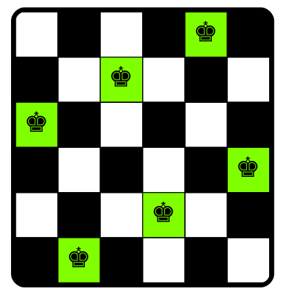

[](https://classroom.github.com/online_ide?assignment_repo_id=6148789&assignment_repo_type=AssignmentRepo)

# Parallelizing N-Queens

Integrantes:
- Sharon Chullunquía Rosas
- Jerson Zúñiga Coayla

## Requirements
- [OpenMP](https://www.openmp.org/)

## Compile
```sh
g++ -std=c++17 -fopenmp parallel.cpp -o parallel.out
```

## Run
```sh
./parallel.out -problemType [all, find] -N <queens>
```

## Results
Generate chessboard for a solution with `dot` from Graphviz.
```sh
dot -Tpng graph.dot -o graph.png
```


